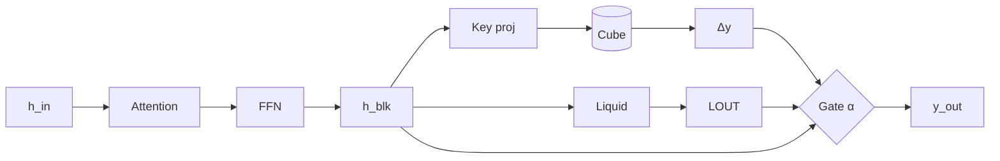
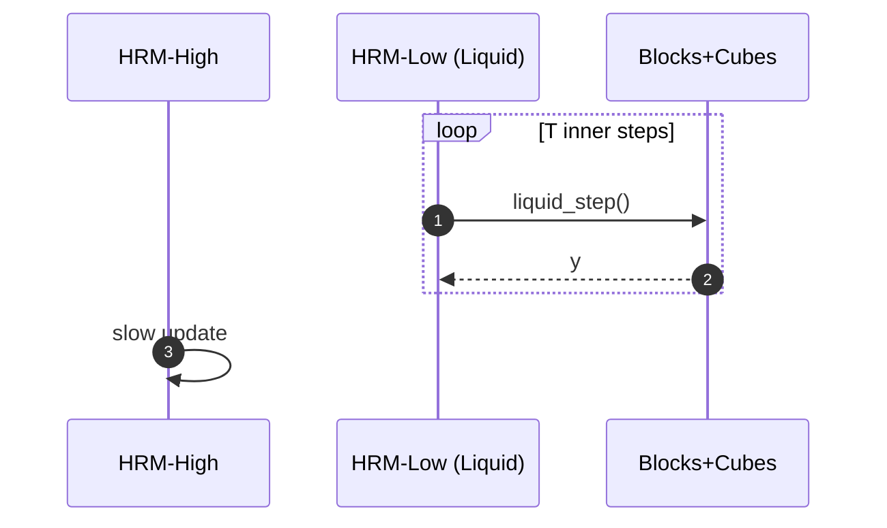
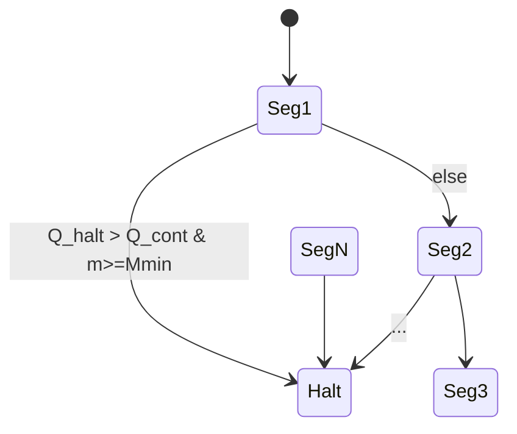

# Mermaid Diagram Gallery

Collected diagrams for architecture and flows.

---

## 1. Hybrid Block

```mermaid
flowchart LR
  A[h_in] --> ATTN[Attention]
  ATTN --> FFN[FFN]
  FFN --> H[h_blk]
  H --> K[Key proj]
  K --> CUBE[(Cube)]
  H --> LNN[Liquid]
  CUBE --> PRED[Δy]
  LNN --> LOUT
  PRED --> G{Gate α}
  LOUT --> G
  H --> G
  G --> Y[y_out]
```

---

## 2. HRM Timing

```mermaid
sequenceDiagram
  autonumber
  participant H as HRM-High
  participant L as HRM-Low (Liquid)
  participant B as Blocks+Cubes
  loop T inner steps
    L->>B: liquid_step()
    B-->>L: y
  end
  H->>H: slow update
```

---

## 3. ACT Halting

```mermaid
stateDiagram-v2
  [*] --> Seg1
  Seg1 --> Halt: Q_halt > Q_cont & m>=Mmin
  Seg1 --> Seg2: else
  Seg2 --> Halt: ...
  Seg2 --> Seg3
  SegN --> Halt
```

