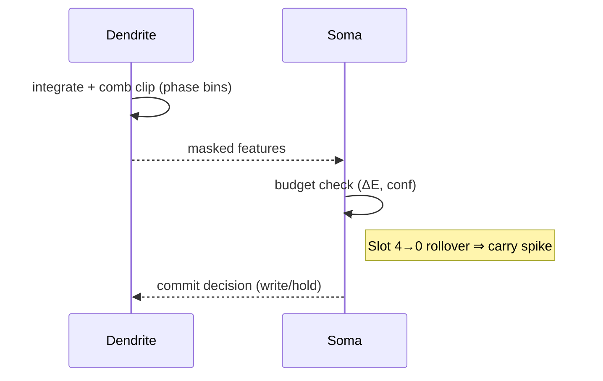

# Dendritic Computation, Rall Unwinding, and HRM+/UKM Mapping

This note ties the formal rational system to biophysical intuition:
- Rall’s 3/2 law (impedance matching) as the “unwinding” that makes comb filters precise.
- HCN1 (Ih), Cav3, Kv7, BK, Nav as the micro-instruction set under phase windows.
- Base-5 envelope (no 5 → carry) as the boundary commit spike.

## Rall Unwinding
- Law: d₀^(3/2) = Σ dᵢ^(3/2) at branch points; equivalent cylinder reduces reflections.
- Consequence: linear phase delays with electrotonic length ℓₑ; interference between paths induces comb notches.
- Mapping: remainder/phase bitmask in the formal system corresponds to comb stencils from path differences; quotient/carry corresponds to dendritic latches under boundary conditions.

## Ion Channels as Comparators
- HCN1: sets theta resonance and flattens peaks (soft clip); creates robust binary-like masks.
- Kv7 (M-current), BK: reset and refractory; control commit windows.
- Cav3: burst doors; Nav: edge creation; together: AND-at-phase, ROTATE-under-bias, XOR-like coincidence.

## Phase Windows and Non-Commutativity
- Beta↔theta crossings act as Schmitt triggers; order of crossings selects different channel synergies (χ∘ρ ≠ ρ∘χ).
- Base-5 envelope: five slots per microcycle; slot 4→0 rollover is control (“carry”), not data.

## HRM+/UKM Integration
- MemoryCube: fused phase keys (fast/mid/slow) + comb masks; confidence is concentration over top-K; gates blend influence, not erase value.
- Liquid fast path: continuous-time updates with soft-capped activations to avoid energy explosions; telemetry logs ΔE.
- Scheduler: explicit Z5×Z8 (five-slot envelope × phase register) reproduces the “no 5 → carry” lattice; only boundary commits write.

Mermaid (microcycle)

## Engineering Invariants (recap)
- Preserve, then gate; monotone energy; explicit schedules; boundary-only commits; first-class telemetry.
