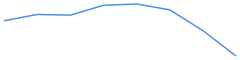
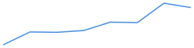

# Telemetry Summary

Files: 1

## alpha_mean
- last: 0.512229; mean: 0.524544 ± 0.00667; min–max: 0.512229–0.531819; n=8

## conf_mean
- last: 0.531113; mean: 0.332562 ± 0.188; min–max: 0–0.531113; n=8

## act_prob_mean
- last: 0.516984; mean: 0.517027 ± 0.0289; min–max: 0.480183–0.578431; n=8

## act_open_rate
- last: 0.5625; mean: 0.550781 ± 0.0899; min–max: 0.4375–0.71875; n=8

## energy_pre_gate
- last: 31.8152; mean: 31.9064 ± 0.0665; min–max: 31.8152–31.9999; n=8

## energy_post_gate
- last: 31.8152; mean: 31.9064 ± 0.0665; min–max: 31.8152–31.9999; n=8

## loss
- last: 4.27843; mean: 4.3106 ± 0.0652; min–max: 4.24584–4.44455; n=8

## ce
- last: 4.27326; mean: 4.30543 ± 0.0654; min–max: 4.24005–4.43951; n=8

## ponder
- last: 0.516984; mean: 0.517027 ± 0.0289; min–max: 0.480183–0.578431; n=8

