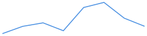
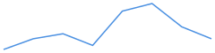
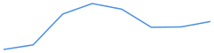

# Telemetry Summary

Files: 1

## alpha_mean
- last: 0.28356; mean: 0.275896 ± 0.00581; min–max: 0.267508–0.28356; n=8

## conf_mean
- last: 0.587335; mean: 0.422689 ± 0.191; min–max: 0–0.587335; n=8

## act_prob_mean
- last: 0.485507; mean: 0.48115 ± 0.0249; min–max: 0.44566–0.528969; n=8

## act_open_rate
- last: 0.25; mean: 0.214844 ± 0.0612; min–max: 0.15625–0.34375; n=8

## energy_pre_gate
- last: 31.7759; mean: 31.8876 ± 0.0763; min–max: 31.7759–31.9999; n=8

## energy_post_gate
- last: 24.9591; mean: 24.9509 ± 0.217; min–max: 24.5435–25.2909; n=8

## loss
- last: 4.25669; mean: 4.3205 ± 0.0832; min–max: 4.22174–4.47906; n=8

## ce
- last: 4.25184; mean: 4.31569 ± 0.0833; min–max: 4.21699–4.47433; n=8

## ponder
- last: 0.485507; mean: 0.48115 ± 0.0249; min–max: 0.44566–0.528969; n=8

