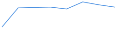
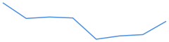

# Telemetry Summary

Files: 1

## alpha_mean
- last: 0.366718; mean: 0.360435 ± 0.0066; min–max: 0.350703–0.370787; n=8

## conf_mean
- last: 0.518081; mean: 0.365109 ± 0.182; min–max: 0–0.520639; n=8

## act_prob_mean
- last: 0.516262; mean: 0.508683 ± 0.0289; min–max: 0.47306–0.559889; n=8

## act_open_rate
- last: 0.34375; mean: 0.394531 ± 0.0929; min–max: 0.3125–0.59375; n=8

## energy_pre_gate
- last: 31.7858; mean: 31.8951 ± 0.0748; min–max: 31.7858–31.9999; n=8

## energy_post_gate
- last: 27.058; mean: 26.8078 ± 0.278; min–max: 26.4475–27.1397; n=8

## loss
- last: 4.49185; mean: 4.32684 ± 0.124; min–max: 4.09343–4.49185; n=8

## ce
- last: 4.48669; mean: 4.32175 ± 0.124; min–max: 4.08829–4.48669; n=8

## ponder
- last: 0.516262; mean: 0.508683 ± 0.0289; min–max: 0.47306–0.559889; n=8

