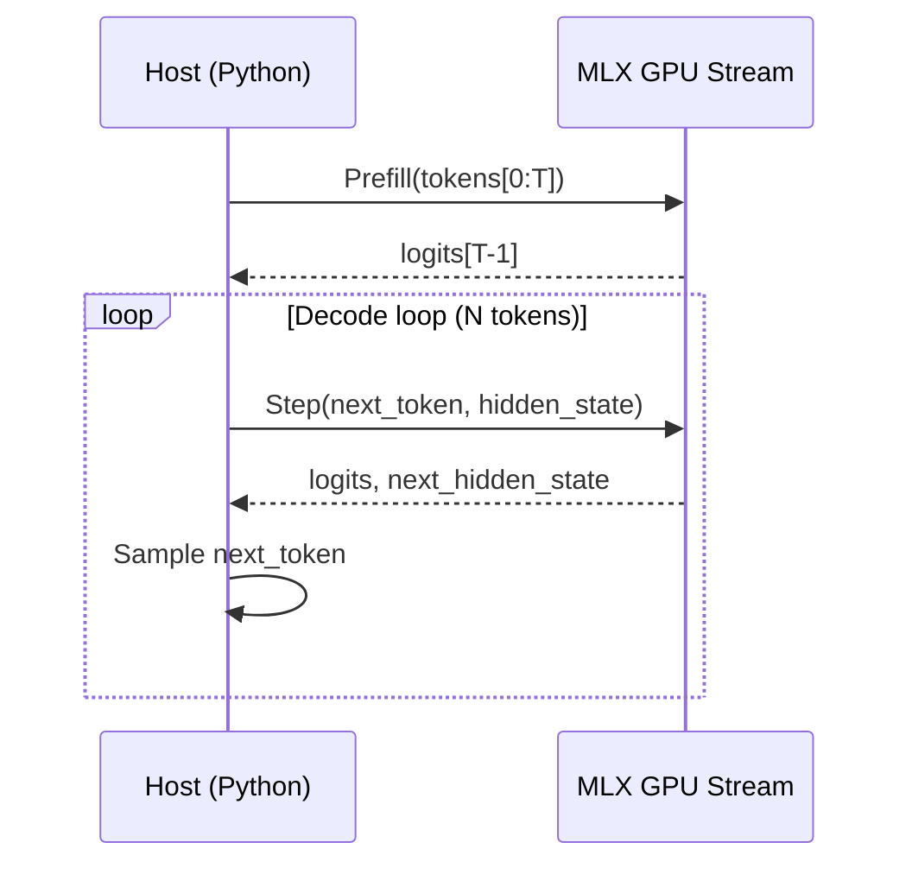

# MLX Inference Architecture (xLSTM)

This document mirrors the PyTorch MPS inference architecture, adapted for MLX.

## High-Level Flow

## Building Blocks

- Embedding → xLSTM blocks (mLSTM + sLSTM) → Projection (head)
- Hidden state returned at each step to support streaming decode
- Optional: projection via tiled Metal GEMM (`XLSTM_MLX_FAST_HEAD=1`)

## Streams

- Use a dedicated GPU stream (e.g., `s_gpu = mx.new_stream(mx.gpu)`) and run prefill/decode under `with mx.stream(s_gpu)`.
- Synchronize only when needed for host decisions or I/O.
- For post‑stream hooks (logging, UI, checkpoints), use `tools/mlx_streams.on_stream_complete` or `after_eval` to avoid blocking other streams.

## Kernels & Numerics

- MLX ops run on GPU; we rely on MLX numerics (float32/float16/bfloat16 as configured by ops).
- Tiled GEMM kernels use float32 accumulation with `fma` to preserve accuracy when inputs are lower precision.
- Avoid dynamic stack arrays and runtime div/mod in kernels; see `docs/metal/Shader-Optimization-Tips.md`.

## Contrasts with PyTorch MPS + Ray

- MLX path: single process, explicit streams, optional custom kernels.
- PyTorch path: compiled step/sequence functions on MPS; prefill scheduled by Ray (actors) or queued threads.
- Ray benefits: dashboard, metrics, distributed orchestration; MLX favors minimal latency and tight inner loops.

## API Entry Points

- `scripts/run_local_xlstm_mlx.py` — CLI runner
- `implementations/mlx/xlstm_mlx.py` — model definition; call with `return_hidden=True` for streaming
- `mlx_fast_kernels/gemm_kernels.py` — `gemm_av`, `gemm_at_b`, `set_gemm_tiles`, `get_gemm_tiles`
- `tools/mlx_streams.py` — stream waiters and asyncio integration

